# 🔐 Azure Identity Security & Incident Response Lab
### *A full Red Team compromise and Blue Team recovery — built, broken, and fixed by one person.*

<p align="left">
  
  
  
  
  
  
</p>

---

## ⚡ TL;DR — What Happened

| Phase | Action | Result |
|-------|--------|--------|
| **Setup** | Provisioned Entra ID lab with Admin + Standard user personas | Clean identity baseline established |
| **Hardening** | Deployed Per-User MFA as free-tier Conditional Access alternative | MFA block confirmed active |
| **Attack** | Exploited MFA *enabled* vs *enforced* gap — hijacked MFA, reset password | Full account takeover. Zero malware. Zero exploits. |
| **Detection** | Pulled Sign-in Logs + Audit Logs | Impossible travel detected (Australia → Seattle). Attack timeline rebuilt. |
| **Response** | Contain → Eradicate → Recover → Document | Session revoked. Rogue MFA removed. Account restored. Audit trail verified. |

> **The attack required zero malware, zero exploits, and zero technical sophistication. Just timing, stolen credentials, and a misconfigured control that millions of organisations have right now.**

---

## 📖 What This Project Is (And Why I Built It)

Most cloud security content teaches you how to *configure* things. This project is about what happens when configuration alone isn't enough.

I designed this lab to simulate a real corporate Microsoft Entra ID environment, then deliberately attack it using a technique that bypasses a control most organisations think is bulletproof: **MFA**. The goal was to understand — at a technical and operational level — exactly how an attacker exploits the gap between *enabling* a security control and *enforcing* it.

This isn't a CTF walkthrough. Every decision mirrors a real-world scenario: budget constraints, identity architecture tradeoffs, the urgency of incident response, and the importance of an audit trail that holds up under scrutiny.

---

## 🛠️ Technical Stack

| Layer | Technology |
|---|---|
| **Cloud Provider** | Microsoft Azure |
| **Identity Platform** | Microsoft Entra ID (formerly Azure AD) |
| **Security Controls** | Multi-Factor Authentication (MFA), Security Groups, RBAC |
| **Monitoring** | Entra ID Sign-in Logs, Audit Logs, Identity Protection |
| **Attack Technique** | VPN Geographic Spoofing, MFA Registration Hijacking |
| **MITRE ATT&CK** | T1556.006 (Modify Authentication Process: MFA), T1078 (Valid Accounts), T1621 (MFA Request Generation) |

---

## 🗺️ The Full Story: A 5-Phase Security Sprint

---

### 🏗️ Phase 1 — Environment Setup `MITRE: T1136 — Create Account`

Every secure environment starts with a solid identity foundation. I provisioned a dedicated lab directory and established two distinct user personas:

- **Admin Account** — elevated privileges, management tasks only
- **Standard User** — least-privilege employee account used as the attack target

A dedicated **Security Group** was configured for policy targeting, keeping the blast radius of any changes controlled and auditable from the start.

> **Real-world constraint hit immediately:** Azure's free tier doesn't include Conditional Access — that's a Premium P2 feature. Rather than parking the project, I documented the roadblock and pivoted to Per-User MFA. This is exactly what engineers do in production when the budget doesn't match the security roadmap.

**Creating the Admin and Standard user accounts**

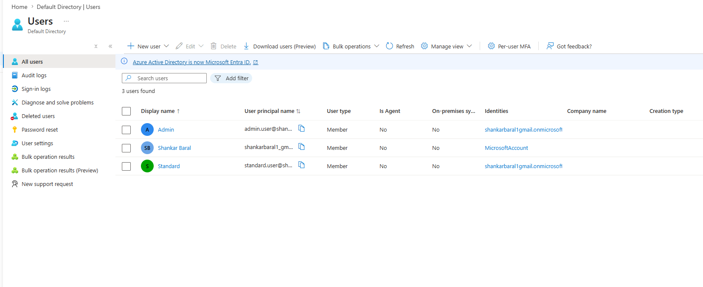

**Setting up the Security Group for policy targeting**

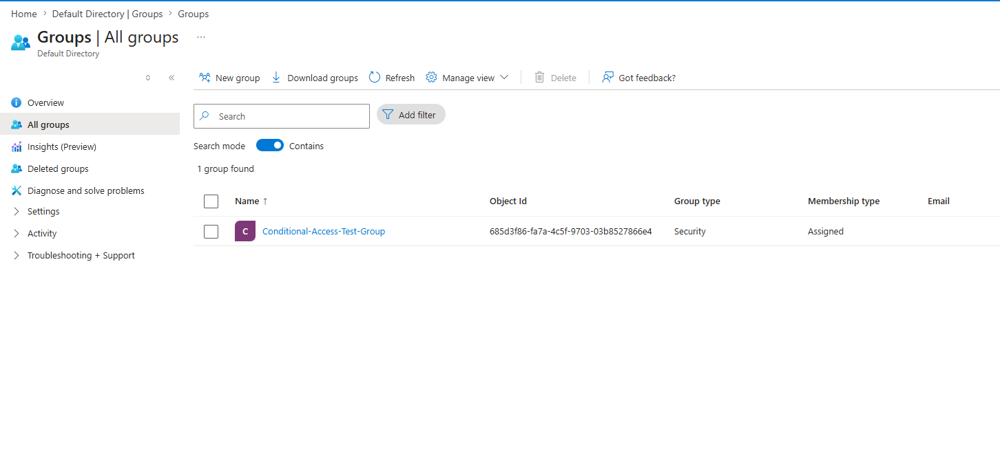

**The licensing constraint — documented, not hidden**

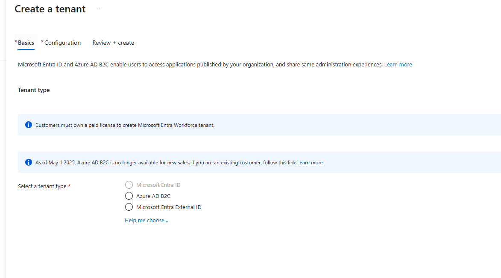

---

### 🔒 Phase 2 — Identity Hardening `MITRE: T1556 — Modify Authentication Process`

With the environment provisioned, I moved to hardening. The free-tier constraint forced a real engineering decision.

**The Pivot:** Conditional Access — the gold standard for enforcing MFA policies — sat behind a P2 licence wall. I implemented **Per-User MFA enforcement** instead. Not the ideal enterprise solution, but a legitimate, effective control using only the tools available.

**Verification:** Before moving to the attack phase, I confirmed hardening was effective — attempting login without completing MFA registration returned a mandatory "More Information Required" block. The perimeter held.

**Conditional Access locked behind P2 — the licensing wall**

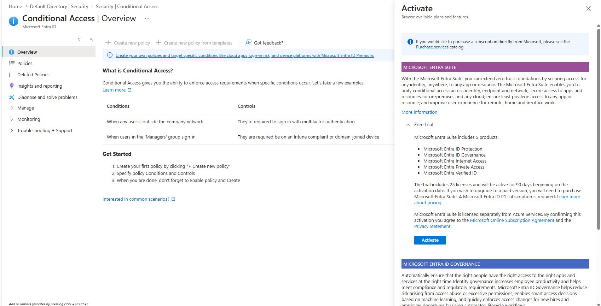

**Activating Per-User MFA as the free-tier alternative**

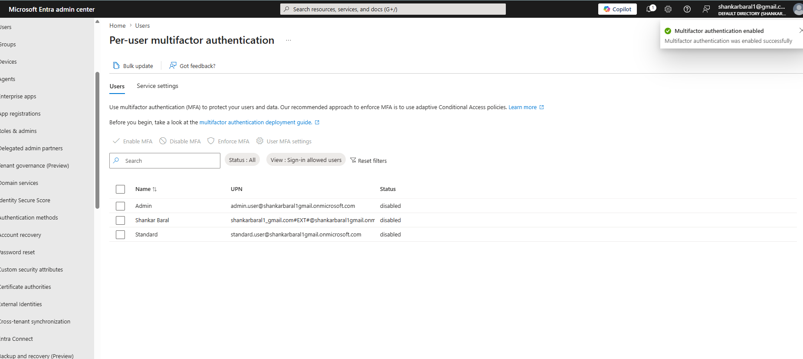

**Verifying the "More Information Required" block is active**

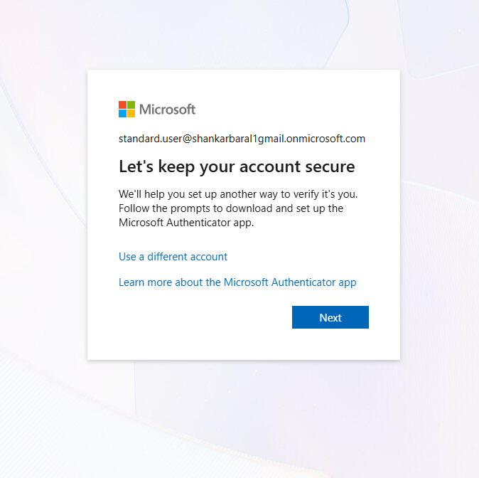

---

### 💀 Phase 3 — The Compromise (Red Team) `MITRE: T1078 — Valid Accounts | T1621 — MFA Request Generation`

Here's what most organisations miss: **MFA *Enabled* ≠ MFA *Enforced*.**

When a user has MFA enabled but hasn't completed registration yet, there is a window. A small one — but an attacker who moves first wins.

**Step 1 — MFA Hijack**
Logged into the target account *before* the legitimate user registered their own MFA device. Registered my authenticator as the primary MFA method. The account now trusts my device, not theirs.

**Step 2 — Establishing Persistence**
Performed an administrative password reset from inside the account. The legitimate user is now locked out completely — they can't log in, and they can't recover via MFA because the attacker controls that channel.

**Step 3 — Full Account Takeover (ATO)**
Complete. No path back in without admin intervention. This technique is actively used in Business Email Compromise (BEC) campaigns targeting Microsoft 365 environments globally.

**Initiating the hijack — attacker's view of the MFA setup screen**

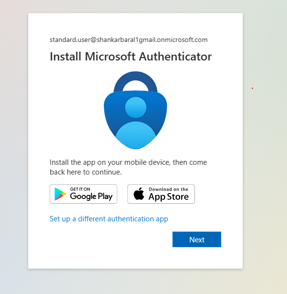

**Attacker's device successfully registered as the trusted MFA method**

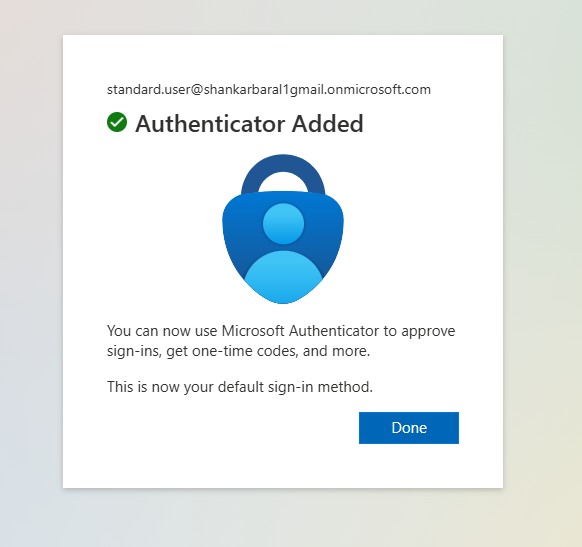

**Attacker resetting the password — legitimate user locked out**

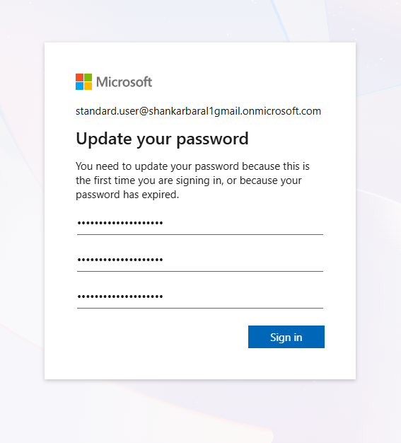

---

### 🔍 Phase 4 — Detection & Analysis (Blue Team) `MITRE: T1078.004 — Cloud Accounts`

Switching hats. The ticket just landed: a user is locked out of their account and doesn't know why.

**Making it realistic:** The attack was conducted over a VPN exiting in **Seattle, WA**. My legitimate admin session was running from **Australia**. That geographic gap was intentional — it's precisely the kind of signal Sign-in Logs capture and that a trained analyst knows to chase.

**The Investigation & Telemetry Breakdown:**
I bypassed basic dashboard graphs and dug directly into the raw event properties to verify the compromise:

- **UserAgent Analysis:** Isolated browser fingerprint shifts between the legitimate user and attacker sessions
- **Cross-Log Correlation:** Reconstructed the timeline by pivoting from the anomaly in Sign-in Logs (identity) to the execution mechanism in Audit Logs (system changes)

| Log Source | Critical Field Isolated | Forensic Value |
|------------|------------------------|----------------|
| **Sign-in Logs** | `Location` / `IP Address` | Confirmed physically impossible travel (AU → Seattle, WA) within minutes |
| **Sign-in Logs** | `Authentication Details` | Showed MFA satisfied via newly added attacker-controlled method |
| **Audit Logs** | `Activity: Update User` | Identified rogue MFA device added to authentication methods |

> **The Sign-in log told me *who* and *where*. The Audit log told me *what*. Together, they rebuilt the entire attack timeline.**

**The smoking gun — Sign-in log showing Seattle, WA login from an AU account**

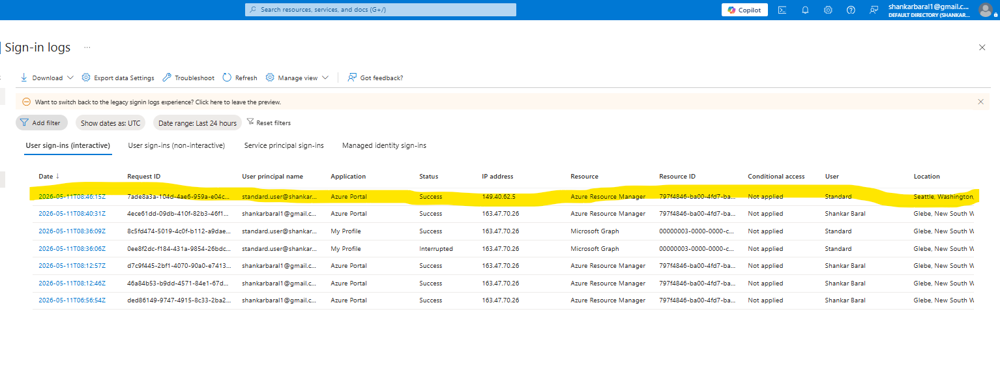

**Confirming the rogue MFA registration in the authentication metadata**

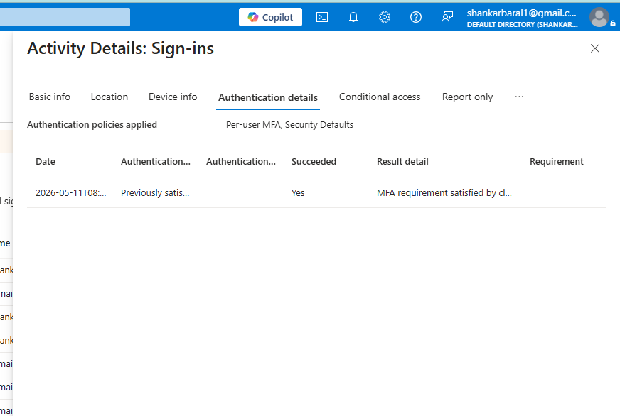

---

### 🛡️ Phase 5 — Incident Response & Recovery `NIST SP 800-61 r2 Alignment`

Detection means nothing without a documented, repeatable response.

**🔴 Contain — Global Session Revocation**
Immediately terminated every active session on the compromised account. The attacker was kicked out of all active portal sessions simultaneously — mid-session, no warning.

**🟠 Eradicate — Rogue MFA Method Deletion**
Removed the attacker's device from the account's trusted authentication methods. Backdoor eliminated.

**🟢 Recover — Identity Restoration**
Performed a final administrative password reset, returning clean credentials to the legitimate user.

**📋 Document — Audit Trail Verification**
Confirmed every remediation action appears in the Audit Logs with accurate timestamps. In a real incident, this is what you hand to your CISO, legal counsel, or a regulator. **If it isn't in the logs, it didn't happen.**

**Admin revoking all active sessions — attacker evicted**

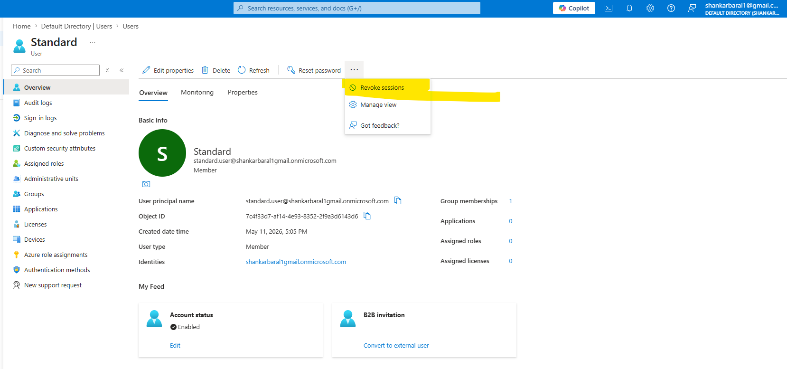

**Removing the attacker's phone from trusted authentication methods**

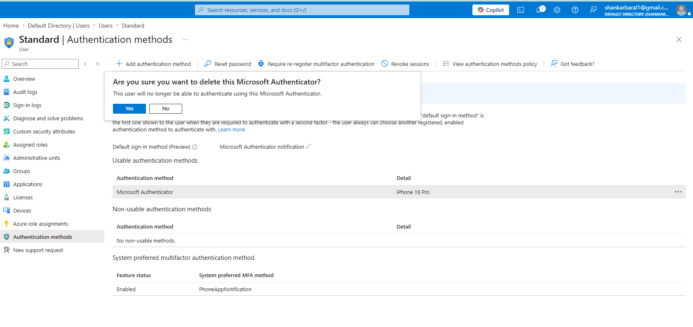

**Final admin password reset**

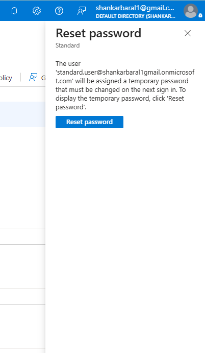

**Password reset successful — account restored**

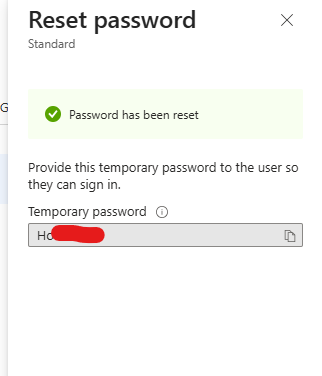

**Audit log showing every admin action taken during the incident**

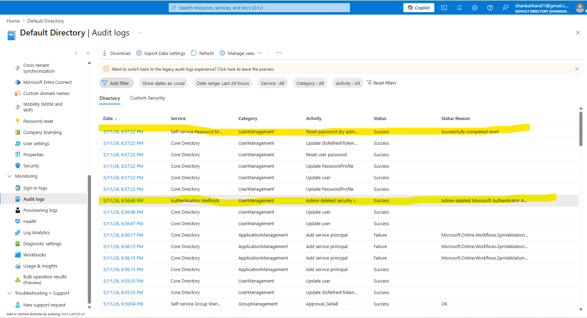

---

## 🧠 Key Findings & Lessons Learned

### 1. The MFA Gap Is Real — And Widely Underestimated

The attack in Phase 3 required zero malware, zero exploits, and zero technical sophistication. Just timing and stolen credentials. Organisations that enable MFA and consider the job done are leaving a window open.

**The fix:** Enforce **Registration Campaigns** immediately upon account creation so users register before an attacker can. Or use **Conditional Access with Trusted Locations** (P2) to block authentication from unrecognised regions entirely.

---

### 2. Two Log Sources. One Complete Picture.

Most analysts pull one log and stop there.

| Log Source | What It Tells You |
|------------|-------------------|
| **Sign-in Logs** | Behavioural anomalies — impossible travel, unfamiliar locations, new device fingerprints |
| **Audit Logs** | Administrative actions — MFA method changes, password resets, role assignments, group changes |

You need both to reconstruct a full attack timeline. Either one alone leaves gaps a good attacker can hide in.

---

### 3. A Constrained Environment Is Not a Defenceless One

Premium licences unlock powerful automation. But Per-User MFA, Sign-in Logs, and Audit Logs exist at every tier. The tools here cost nothing. What they require is an analyst who knows how to use them.

---

## 🔮 What's Next

This lab deliberately ends with manual hunting and manual response. The natural next iteration is automation:

- **Integrate Microsoft Sentinel** — replace manual log review with automated analytic rules that fire on impossible travel and MFA registration anomalies
- **Build KQL Watchlists** — flag high-risk IP ranges and known VPN exit nodes automatically
- **Automate Containment via Logic Apps** — trigger Global Session Revocation the moment an anomaly is detected, cutting attacker dwell time from hours to seconds
- **🤖 Pilot AI-Driven Orchestration** — use **IBM watsonx Orchestrate** to build an autonomous agent that catches an Impossible Travel event, queries threat intelligence APIs to verify if the source IP is a known VPN exit node, and routes a high-priority eviction command if confirmed

*The Sentinel foundation is already live — see the [Dual SIEM Detection Lab](https://github.com/shank078/Dual-SIEM-Detection-Lab) and [Azure Sentinel Honeypot SIEM](https://github.com/shank078/azure-sentinel-honeypot-siem)*

---

## 📁 Repository Structure

```
azure-identity-security-lab/
├── images/
│   ├── 01_entra_user_provisioning.png
│   ├── 02_security_group_configuration.png
│   ├── 03_licensing_constraint_documentation.png
│   ├── 04_premium_feature_restriction.png
│   ├── 05_manual_mfa_enforcement.png
│   ├── 06_mfa_login_verification.png
│   ├── 07_attacker_mfa_registration.png
│   ├── 08_unauthorized_mfa_method_added.png
│   ├── 09_persistence_via_password_reset.png
│   ├── 10_impossible_travel_vpn_log.png
│   ├── 11_authentication_metadata_analysis.png
│   ├── 12_global_session_revocation.png
│   ├── 13_rogue_mfa_method_deletion.png
│   ├── 14_administrative_identity_recovery.png
│   ├── 15_remediation_success_confirmation.png
│   └── 16_final_audit_trail_verification.png
├── documentation/
│   └── incident-response-log.md
└── README.md
```

---

## 🔗 Related Projects

| Project | Description |
|---------|-------------|
| [Dual SIEM Detection Lab](https://github.com/shank078/Dual-SIEM-Detection-Lab) | 5 MITRE-mapped detections across Sentinel + Splunk on live attacker traffic |
| [Azure Sentinel Honeypot SIEM](https://github.com/shank078/azure-sentinel-honeypot-siem) | 1,400+ real brute-force attempts captured and mapped globally |
| [SOAR Pipeline — Sentinel to Jira](https://github.com/shank078/azure-sentinel-jira-soar-pipeline) | Zero-touch automated incident ticketing |

---

## 👤 About the Author

**Shankar Baral** — Junior Cyber Security Analyst & IT Support Specialist
Master of Information Technology (Cyber Security) · GPA 4.92 · Australian Permanent Resident · Canberra, ACT

[](https://linkedin.com/in/shankarbaral1)
[](https://github.com/shank078)
[](mailto:shankarbaral1@gmail.com)

*Open to Junior SOC Analyst and Security Engineer opportunities in Australia.*

---

> *This lab was built to understand how real attackers think — not to simulate one. The most dangerous attacks don't need malware. They just need a misconfigured control and a head start.*
